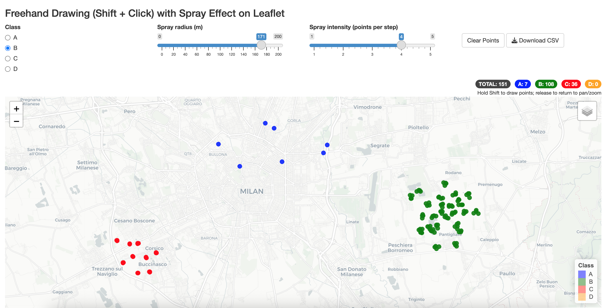

# Spray Map App (Shiny + Leaflet)

This Shiny application allows you to **draw points on an interactive Leaflet map** using a *spray effect*.  
Points are added **randomly distributed inside a circle** centered at the cursor position while holding **Shift + Left Click**.

---

## 📸 Preview


---

## ✨ Features
- **Spray effect**: Distribute multiple points randomly within a configurable radius.
- **Shift + Left Click drawing**: Hold Shift to draw; release to return to normal pan/zoom.
- **Configurable parameters**:
  - Spray radius (meters)
  - Spray intensity (points per step)
- **Live counters**:
  - Total points
  - Per-class points
- **Multiple classes**: Points can belong to one of 4 classes (`A`, `B`, `C`, `D`), each with a distinct color.
- **Export**: Download all generated points as a CSV file (`point_id, class_id, lon, lat, class`).
- **Clear**: Reset all points on the map.

---

## 🖥 Usage
1. Launch the app in RStudio:
   ```r
   library(shiny)
   runApp("path/to/SprayMapApp")
   ```
2. Use the **radio buttons** to select a class.
3. Adjust **spray radius** and **intensity** sliders as needed.
4. **Hold Shift** and **left click + drag** to draw points.
5. View the counters for total and per-class points in the top right.
6. Use **Download CSV** to save points.
7. Use **Clear Points** to reset.

---

## 📦 Requirements
- R (≥ 4.0.0)
- Packages:
  ```r
  install.packages(c("shiny", "leaflet", "htmlwidgets"))
  ```

---

## 📂 File structure
```
SprayMapApp/
├── app.R          # Main Shiny application
├── screenshot.png # Preview image (optional)
└── README.md      # This file
```

---

## 👨‍💻 **Authors & Credits**
- **Author**: [Luca Dell'Anna](https://www.linkedin.com/in/lucadellanna/) — Main developer of this Shiny application.
- **First Author of Original Spray Logic**: [Joachim Schork](https://www.linkedin.com/in/joachim-schork) — Inspiration for the spray drawing method.

---

**License**: MIT (feel free to use and modify with attribution)
